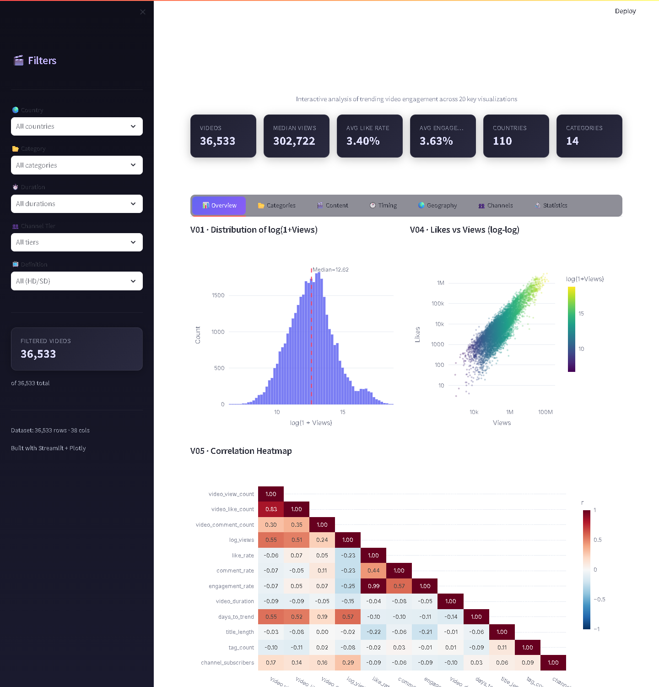
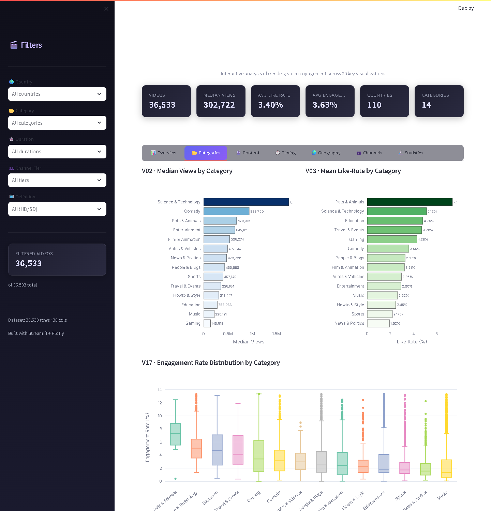
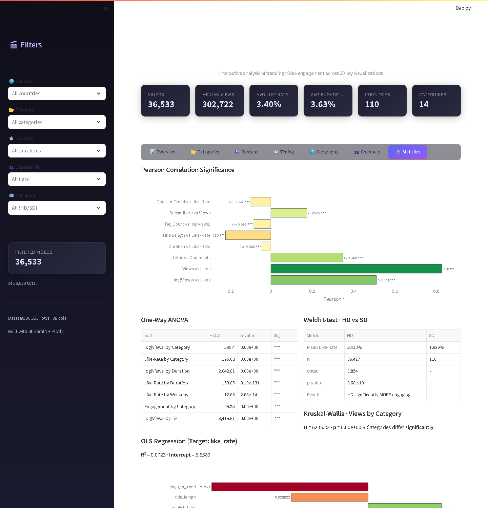

# YouTube Content Success Analytics 

Members of Team 3:
Aditya Pandey, Dhruv Pandey, Ishika Goel, Udit Narayan, Ratnesh Patil, Dhananjay

Capstone project analysing engagement drivers and content-performance trends across
~36,500 unique trending YouTube videos (deduplicated from ~450k trending appearances).

## Contents
- `youtube_content_success_analytics.ipynb` — cleaning, EDA, 16 visualizations, statistical tests
- `dashboard/` — interactive Streamlit dashboard (`app2.py`, 7 tabs, 20 visualizations)
- `reports/` — Data Quality and EDA reports
- `presentation/` — final presentation deck
- `figures/`, `outputs/` — saved charts and summary tables

## Dashboard

An interactive dashboard to explore engagement across categories, video length, publish
timing, geography, channels, and a full statistics tab.

### Run it
```bash
pip install -r dashboard/requirements.txt
streamlit run dashboard/app2.py
```
Then open http://localhost:8501 in your browser.

### Screenshots
**Overview** — KPIs, view distribution, likes-vs-views, correlation heatmap


**Categories** — median views and like-rate per category


**Statistics** — correlation, ANOVA, t-test, Kruskal-Wallis, OLS regression


## Tools
pandas · numpy · scipy · scikit-learn · matplotlib · seaborn · plotly · streamlit

## Data
The raw dataset (`youtube_trending_3_countries.csv`, ~1 GB) is not committed — download it
from Kaggle. The dashboard runs from the included `dashboard/youtube_trending_videos_global.parquet`.
